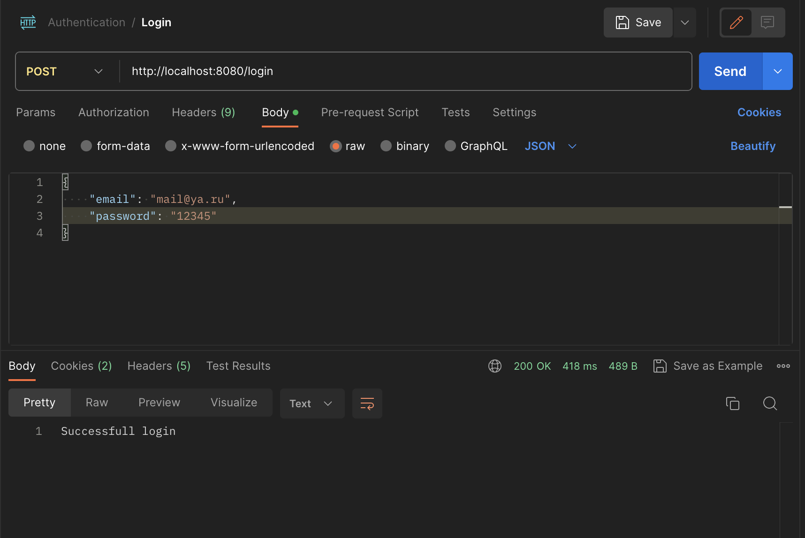

# Авторизации
___
## Содержание
- [Задание](#задание)
  - [Общие требования](#общие-требования)
  - [Технические требования](#технические-требования):
- [Реализация](#Реализация)
  - [Структура проекта](#структура-проекта)
  - [Маршруты](#маршруты)
  - [Скриншоты](#скриншоты)
___
## Задание
Написать часть сервиса аутентификации

## Общие требования:
Два REST маршрута:
- Первый маршрут выдает пару Access, Refresh токенов для пользователя с идентификатором (GUID) указанным в параметре запроса
- Второй маршрут выполняет Refresh операцию на пару Access, Refreshтокенов

## Технические требования:
- Access токен тип JWT, алгоритм SHA512, хранить в базе строго запрещено.
- Refresh токен тип произвольный, формат передачи base64, хранится в базеисключительно в виде bcrypt хеша, должен быть защищен от изменения настороне клиента и попыток повторного использования.
- Access, Refresh токены обоюдно связаны, Refresh операцию для Access токена можно выполнить только тем Refresh токеном который был выдан вместе с ним.
___
## Реализация
Написал часть сервиса аутентификации с использованием MongoDB и JWT. 

### Структура проекта
```
cmd
└── authentication
  └── main.go <- Точка входа
internal
├── app
│   └── app.go <- Инициализирующий код
├── entity
│   └── ... <- Сущности для БД
├── handlers
│   ├── jwt_manager.go <- Обработчик токенов
│   └── user.go <- Обработчик запросов
└── usecase
    ├── repo
    │   └── ... <- Реализации интерфейсов репозиториев
    ├── interfaces.go <- Интерфейсы юзкейсов и репозиториев
    └── ... <- Реализации интерфейсов юзкейсов
.env <- Переменные окружения
```
___
## Маршруты
Реализовал следующие маршруты:

### Register
В теле запроса передается JSON файл, который содержит email и password. 
На стороне сервера происходит хэширование пароля, генерация его uuid и запись в БД

### Login
В теле запроса передается JSON файл, который содержит email и password.
На стороне сервера происходит валидация введенных данных и в случае успеха в cookie записывается [refresh](#refresh-token) и [access](#access-token) токены. Создаётся сессия пользователя

*P.S. Отошёл от технического требования получения токенов с помощью передачи uuid, потому что посчитал неправильным передачу его в теле запроса, ведь передавать 36 символов, 4 из которых '-', более затратное, нежеле передавать email пользователя*
### Refresh
Получается refresh токен с cookie, происходит его валидация и в случае успеха обновляются refresh и access токены и сессия пользователя 

### Validate
В теле запрсоа передается JSON c email пользователя, берётся access токен с cookie и происходит его декодирование, в случае успеха получаем соответсвующий ответ

### Access token
Является JWT, в paylode содержит дополнительную информаци: email пользователя, шифруется SHA512, сигнатура содержится в .env файле

### Refresh token
Является массивом byte, длинна которого берется с .env файла, генерируется с помощью crypto

### Скриншоты
Пример успешных запросов, сделанных с помощью Postman





